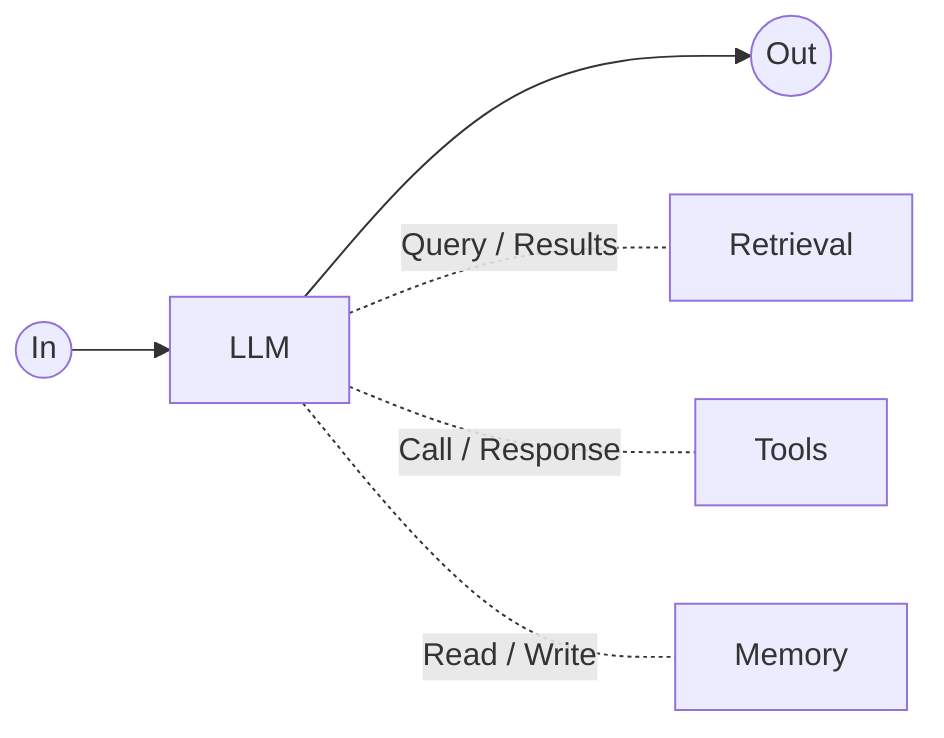

# Building Effective Agents：从最小智能单元到 Agent 工程边界

原文：[Building effective agents](https://www.anthropic.com/engineering/building-effective-agents?lang=en-US)

## 核心理解

这篇文章不是在说“Agent 多厉害”，而是在讲一条更克制的 AI 工程路线：

> AI 应用不是一上来就做复杂 Agent，而是先理解最小智能单元，再理解这些单元如何被编排，最后再判断什么时候值得让模型自己编排。

更具体地说，Agent 应该服务业务，而不是为了技术完整性强行增加复杂功能。很多简单问题用普通后端逻辑、一次 LLM 调用，或者稳定 workflow 就能处理；只有当业务真的需要模糊判断、动态规划、多步工具使用和反馈迭代时，复杂 Agent 才有意义。

我读完后的核心判断是：

> 有效的 Agent 不是让模型什么都自己干，而是把 LLM 的软判断能力，放进一个由上下文、工具、记忆、工作流、测试和约束共同组成的工程系统里。

这篇文章对我最大的提醒是：先问业务需要什么，再决定 Agent 应该做到什么级别。Agent 是提效手段，不是炫技目标。

## 1. 最小单元：Augmented LLM

我一开始纠正得很关键：文章里那个图不是一个固定流程，不是：

```text
先 RAG -> 再工具 -> 再记忆 -> 再输出
```

更准确是：

```text
一个 LLM 决策单元
= 模型本身
+ 本次上下文 context
+ 可选能力：retrieval / tools / memory
```

文章里的图可以这样理解：



这张图的重点不是流程顺序，而是能力关系：

- `In -> LLM -> Out` 是一次模型调用的主路径。
- `Retrieval` 是 LLM 在需要外部知识时发起查询，再把结果拿回来。
- `Tools` 是 LLM 在需要执行动作时调用外部能力，再接收返回结果。
- `Memory` 是 LLM 在需要历史状态时读取，或在需要沉淀信息时写入。

所以图里的虚线不是说“每次都必须走 retrieval、tools、memory”，而是说 LLM 可以按需和这些外部能力交互。

也就是说，这个单元每次被调用时，可能只检索，可能只调用工具，可能读取记忆后再回答，也可能什么外部能力都不用。

我的理解可以保留下来：

> 每一个 augmented LLM call 都像一次“小决策”。

它不是整个系统，但它也可以在微观上完成一次完整处理。后面的 workflow 和 agent，都是在组合这些“小决策单元”。

也可以把它理解成一个个最小单元块 / 能力块。这样比只说“LLM 动态决定流程”更容易落地理解：复杂 Agent 不是凭空出现的，而是由许多带上下文、工具、检索、记忆能力的小单元块组合出来的。

这里还把一个容易混的点理清了：

```text
history = 对话历史，常见短期记忆实现
memory = 更泛化的保存状态
context = 本次真正传给模型的输入包
```

真实系统里，context 可能包括：

```text
1. 指令层
- system prompt
- developer instruction
- Skill / 任务方法说明

2. 当前任务层
- 用户当前输入
- 任务状态
- 当前计划 / 进度
- 当前错误信息

3. 外部信息层
- 对话历史
- 长期记忆摘要
- 检索结果
- SQL / API 返回
- 工具调用结果
- 文件内容 / 代码片段
```

所以更准确的关系是：

```text
memory / history / RAG / tool results
        ↓ 选择、压缩、组装
context
        ↓
LLM API
```

模型不会自动拥有项目里的全部记忆。应用要把相关内容选出来，放进这次 context，模型这次才能看到。

## 2. Workflow 和 Agent 的真正区别

最后收敛到的判断是：

```text
Workflow:
人 / 代码提前编排这些 LLM 单元。

Agent:
模型在运行时自己编排这些 LLM 单元。
```

所以区别不在于形状。横向链式、纵向并行、循环迭代，这些形态 workflow 可以有，agent 也可以临时形成。

我说的“数据流转意识”可以这样保留：

```text
横向：链式调用，一个节点接一个节点
纵向：并行拆分，多个节点同时处理
循环：生成、检查、修改、再生成
```

区别是：

- workflow 的流转方式是开发者提前设计好的；
- agent 的流转方式是模型根据目标、工具反馈、环境状态动态生成的。

这也解释了文章为什么一直强调：不要为了 agent 而 agent。
如果流程本来就能写清楚，用 workflow 更稳定、更便宜、更好测。

## 3. 几种 Workflow 模式

文章里的 workflow pattern，本质是在用不同方式编排 augmented LLM 单元。

| 模式 | 我的理解 | 适合场景 |
| --- | --- | --- |
| Prompt chaining | 横向链式推进，一个节点接一个节点 | 稳定的多步骤任务 |
| Routing | 类似 `if else`，先分类，再走不同路径 | 输入类型差异明显的任务 |
| Parallelization | 纵向并行拆分，多个分支同时处理，再汇总 | 多视角 review、安全检查、缩短耗时 |
| Orchestrator-workers | 主控动态拆任务，worker 执行，主控汇总 | 子任务数量和形态不固定 |
| Evaluator-optimizer | 生成、评估、修改、再评估 | 写作、代码、翻译、需要质量迭代的任务 |

我对并行的判断也可以留下：

> 并行最好不要让多个分支读写同一块可变状态，否则容易出现冲突、覆盖、重复工作和状态不一致。

循环是我觉得很重要的一类，因为它让系统不是“一次性生成”，而是可以通过反馈不断逼近目标。但循环一定要有停止条件、成本控制和验收标准。

## 4. Retrieval、Tool、Memory：概念分开，工程上交叉

这篇文章里提到 retrieval、tools、memory，但不能把它们理解成严格分层、互不重叠的三个东西。

更准确的理解是：

```text
概念上，它们可以分开；
工程上，它们经常交叉；
微观上，每一个内部还能继续拆成很多机制。
```

这和 Agent 本身有点像：宏观看是一个系统能力，微观看又是许多小决策、小工具、小状态管理的组合。

我现在把 tool 理解成：

```text
Tool:
模型可以调用的外部能力接口。
```

它可以是：

- 查数据库。
- 查订单。
- 搜索文档。
- 调用 API。
- 读写文件。
- 执行 CLI。
- 跑测试。
- 发消息。

同时，RAG / retrieval 可以这样理解：

```text
RAG / Retrieval:
本质目标是“找相关信息”，让模型回答时能看到外部知识。
```

但在工程实现里，RAG 往往会被包装成一个 tool，例如：

```text
search_docs(query)
vector_search(query, top_k)
search_codebase(question)
```

所以 RAG 可以从两个角度理解：

- 从功能意图看，它是 retrieval，是“找信息”。
- 从调用形态看，它经常就是一个 tool，是模型可以调用的外部能力。

Memory 也一样。概念上它是“保存状态”，但工程上读写 memory 也常常表现为 tool：

```text
get_user_profile(user_id)
save_memory(summary)
search_past_decisions(query)
```

检索结果也可能进入 memory。比如一次搜索得到的重要结论，被系统摘要保存下来，后面又作为长期记忆被取出。

所以它们不是硬分层，而是互相转化、互相引用：

```text
retrieval 可以被包装成 tool；
memory 可以通过 tool 读取或写入；
tool result 可以进入 context；
重要的 retrieval/tool result 可以被写入 memory；
memory 里的内容下次又可能被 retrieval 取出来。
```

比如：

| 能力 | 从文章主线看 | 工程上可能长什么样 |
| --- | --- | --- |
| Retrieval / RAG | 找相关信息 | `search_docs(query)` / `vector_search(query)` |
| Memory | 读写保存状态 | `get_user_profile(user_id)` / `save_summary(text)` |
| 业务 Tool | 调用业务能力 | `refund_order(order_id)` / `create_ticket(payload)` |
| 环境 Tool | 操作运行环境 | `read_file(path)` / `run_tests(path)` |

这里保留一个判断：

> Tool 是模型连接外部世界的接口；RAG / retrieval、memory、业务 API、文件系统、CLI 都可能被包装成 tool。

再往微观看，每个概念内部还可以继续展开：

```text
Retrieval:
chunking、embedding、向量检索、关键词检索、rerank、上下文拼装。

Tool:
工具描述、参数 schema、权限、错误处理、返回格式、调用日志。

Memory:
写入策略、读取策略、压缩策略、遗忘策略、冲突处理、重要性判断。
```

所以我的理解是：这些概念要能分得开，但不能理解得太死。它们各自有功能意图，但在真实 Agent 系统里会彼此融合。

## 5. MCP、Tool、Skill 的位置

这部分有一部分是结合当前实践的延展，不完全是原文主线。原文重点在 tool 和 ACI；Skill 和 MCP 是为了和现在常用的 Agent 开发方式对齐。

```text
MCP:
一种把外部 tools / resources / prompts 标准化暴露给模型应用的协议。

Tool:
可执行的外部能力，有输入、输出、参数、错误结果。

Skill:
可复用的任务方法 / 说明书，里面可能包含流程、脚本、模板、工具使用指南。
```

MCP 这里不用展开太深，只保留一个对比：

```text
MCP 本身不是 tool；
MCP 是把 tools / resources / prompts 标准化暴露出来的协议；
MCP server 暴露出来的一项项能力，才可能成为模型可调用的 tool。
```

例如：

```text
GitHub MCP server
    ├── list_pull_requests(...)   -> tool
    ├── get_issue(...)            -> tool
    └── create_comment(...)       -> tool
```

也就是说：

```text
MCP server 不是单个 tool；
MCP server 暴露的一项项能力才是 tool。
```

Skill 也不完全等于 tool。

Skill 更像“教 agent 怎么做某类任务”；tool 更像“agent 可以调用的具体能力”。

比如：

```text
get_current_time(location) 是工具。
PDF 处理 skill 是一套工作方法。
RAG search_docs(query) 是检索工具。
MCP server 是把这些能力标准化暴露出来。
```

Skill 更常见的位置是在 context 里，特别像一种“任务方法注入”：

```text
system prompt
developer instruction
用户当前输入
Skill / 操作方法 / 注意事项
工具描述
历史记录
检索结果
工具执行结果
```

所以 Skill 通常属于：

```text
注入到 context 里的方法说明 / 过程知识 / 操作规程
```

如果一个 Skill 里面还带脚本或命令，那么脚本执行本身又可能变成 tool 调用；脚本执行后的输出，再作为 tool result 放回 context。

可以这样理解：

```text
Skill:
告诉模型“这类任务应该怎么做”。

Tool:
让模型“真的去执行某个动作”。

MCP:
把一批 tools / resources / prompts 标准化暴露给模型应用。
```

这个区分对后面学习 MCP、skills、tool calling 很重要。否则容易把所有“能让模型做事的东西”都混成一类。

## 6. 附录一：为什么客服和 coding agent 适合 Agent

客服场景适合 agent，是因为用户输入天然混乱、模糊、多样：

```text
用户可能问政策
可能查订单
可能投诉
可能要求退款
可能补充上下文
可能表达情绪
```

如果全靠 workflow，每种情况都提前写死，会非常臃肿。

Agent 的价值在于：它可以根据用户输入临时判断该查知识库、查订单、调用退款工具，还是先追问信息。

Coding agent 也类似。

它适合 agent，不是因为“写代码很酷”，而是因为它有很强的环境反馈：

```text
读文件
改代码
跑测试
看报错
再修改
再验证
```

这天然适合循环。

我说“循环是重中之重”，这个判断可以保留。没有循环，agent 很容易只是一次性生成；有了测试、lint、运行结果这些反馈，它才真正能迭代逼近目标。

### Coding Agent 链路：澄清循环和验证循环

文章后面这个 coding agent 图，可以理解成一个完整 Agent 的简化链路。


这条链路可以拆成几步：

```text
用户提出需求
-> 产品界面接收
-> 界面把用户输入、历史、项目状态、工具说明等组装成 context
-> LLM 理解语义
-> 如果任务不清楚，就反复澄清 / 细化
-> 任务清楚后，LLM 调用工具搜索文件
-> 环境返回文件路径 / 搜索结果
-> LLM 写代码
-> 环境返回写入状态
-> LLM 跑测试
-> 环境返回测试结果
-> 如果测试不通过，继续改代码、看状态、跑测试
-> 通过后 LLM 汇报完成
-> 产品界面展示给用户
```

我觉得这张图最关键的是两个循环。

第一个循环是：

```text
Until tasks clear
```

也就是在真正动手之前，先把用户模糊需求变得足够明确。这里体现的是 LLM 的软能力：理解自然语言、追问、细化任务、确认边界。

第二个循环是：

```text
Until tests pass
```

也就是执行过程中不是一次性生成代码，而是通过环境反馈不断修正。这里体现的是 Agent 的核心循环：

```text
行动 -> 观察结果 -> 调整 -> 再行动
```


这也说明了 coding agent 为什么适合 agent 形态：它不是一次性写代码，而是在澄清、搜索、修改、验证、再修改的过程中不断吸收反馈。

## 7. 附录二：工具设计其实是 Agent 的界面设计

这里是文章最工程化的地方。

Anthropic 的核心意思是：

> 给 agent 设计工具，就像给人设计 UI 一样重要。

工具不是随便暴露一个函数名就完了。工具格式包括：

```text
工具名
工具描述
参数名
参数类型
参数说明
返回格式
错误格式
使用示例
什么时候用
什么时候不要用
```

我对“硬约束”和“软能力”的理解可以放在这里：

- LLM 擅长模糊理解、规划、总结、创造；
- 但路径、ID、金额、权限、文件路径、格式这些硬东西，不能让它猜。

所以工具设计的目标是：

```text
模糊处让模型判断；
确定处让系统约束；
中间用清晰工具接口连接。
```

比如相对路径那个例子，本质不是“模型笨”，而是工具接口给了它猜的空间。

```text
path
```

对模型来说太模糊。

```text
absolute_file_path
```

就更明确。

要求绝对路径，就是把一个容易模糊的问题变成硬约束。

这不是代码洁癖，而是 Agent-Computer Interface 的一部分。

这里对应我的核心理解：Agent 系统要同时利用“软”和“硬”。

```text
软：
让模型理解模糊语义、生成更自然的表达、做初步规划。

硬：
让工具、schema、权限、测试、参数格式保证稳定输出。
```

软能力带来灵活性，硬约束带来可靠性。真正的工程能力，就是知道什么时候该放开模型，什么时候必须收紧边界。

### ACI 的不同层：Prompt / Skill / Tool / MCP

我现在可以把 Prompt、Skill、Tool、MCP 统一看成 ACI 的不同层。

它们都是在帮 Agent 和计算机系统交互，只是约束方式不同：

| 层次 | 作用 | 更像什么 | 设计重点 |
| --- | --- | --- | --- |
| Prompt | 规定角色、目标、约束、输出方式 | 任务说明 | 目标清楚、边界明确、输出格式稳定 |
| Skill | 注入某类任务的方法、流程、注意事项 | 操作文档 / SOP | 步骤清楚、示例充分、特殊情况说明完整 |
| Tool | 提供可执行能力 | API / 按钮 / 命令 | 参数明确、返回稳定、错误可理解、权限可控 |
| MCP | 标准化暴露 tools / resources / prompts | 插件协议 / 能力注册表 | 能力边界清晰、schema 标准、调用方式统一 |

设计这些东西时，要站在“使用者”的角度去想。这里的使用者既可以是人，也可以是模型。

如果是人使用一个 Skill，我们希望它像一份好文档：

```text
这个 Skill 解决什么问题？
什么时候该用？
什么时候不该用？
第一步做什么？
输入需要准备什么？
输出应该长什么样？
有哪些示例？
有哪些容易犯错的地方？
遇到特殊情况怎么办？
```

如果是模型使用一个 Tool，我们也要提供类似信息：

```text
工具名是否直观？
参数名是否明确？
参数格式是否强约束？
返回结果是否稳定？
错误信息是否能指导下一步？
是否说明了和相似工具的区别？
是否给了正确示例和反例？
是否让错误变得更难发生？
```

所以写 Prompt、Skill、Tool 时，本质上都要考虑这些因素：

```text
命名：
让使用者一眼知道它做什么。

范围：
说明它适合什么，不适合什么。

流程：
告诉使用者应该怎么一步步做。

示例：
给出典型输入、典型输出、边界情况。

防错：
提前指出常见误用，并通过参数、schema、权限、校验减少错误。

反馈：
让错误信息、测试结果、工具返回能帮助模型继续修正。
```

这也是文章里说的“站在模型角度思考”。模型不是直接理解代码实现，它主要通过名称、描述、参数、示例、上下文来判断怎么使用这些能力。

所以好的 ACI 不是把模型完全固定死，而是：

```text
在需要理解和规划的地方，给模型足够空间；
在必须稳定和精确的地方，用接口、schema、示例和防错设计收紧边界。
```

## 8. 我读出来的总线索

这篇文章表面是在讲 agent，实际是在讲一种 AI 工程方法：

```text
先从 augmented LLM 最小单元开始；
再用 workflow 组合这些单元；
只有当流程无法提前写死、需要动态规划时，再使用 agent；
使用 agent 时，要靠工具、上下文、记忆、测试、sandbox、人工检查来控制复杂度。
```

我的解读里最有价值的几个点是：

```text
1. augmented LLM 是基本构成单位，不是固定流程。
2. workflow / agent 的区别是“谁来编排这些单位”。
3. 横向、纵向、循环是数据流转形态，不是 workflow 独有。
4. RAG 是通用增强能力，可以作为工具实现。
5. context 是本次给模型的输入包，memory/history 是项目维护后再注入进去的东西。
6. Agent 的优势在模糊语义和动态规划，不适合强一致、低延迟、高确定性核心逻辑。
7. 工具接口设计得好，模型能力会被放大；设计得差，错误会在链路里传播。
8. Agent 应该服务业务提效，而不是为了技术完整性强行堆复杂功能。
```

## 我的最终判断

这篇文章让我意识到，Agent 不是一个框架名词，而是一种复杂度管理方式。

真正的 Agent 能力不是“模型能调用很多工具”，而是系统能在合适的位置让模型做模糊判断，在确定性位置交给代码、schema、权限、测试和工具接口约束。

换句话说，Agent 的设计要先从业务需求出发：这个业务到底需要多少智能？是普通后端逻辑就够，还是需要一次 LLM 调用，还是需要 workflow，还是必须让 agent 动态规划？复杂度只有能换来业务收益时才值得引入。

所以我后续学习 Agent 时，不能只问“怎么用 LangChain / LangGraph 实现”，而要先问：

- 这个业务问题真的需要 AI 吗？
- 这个任务是否真的需要 Agent？
- 哪些步骤可以写成稳定 workflow？
- 哪些地方必须让模型动态判断？
- 哪些信息应该进入 context？
- 哪些状态应该沉淀成 memory？
- 工具接口是否足够清晰、可测、可约束？

这才是从“会调用模型”走向“会做 Agent 工程”的关键。
